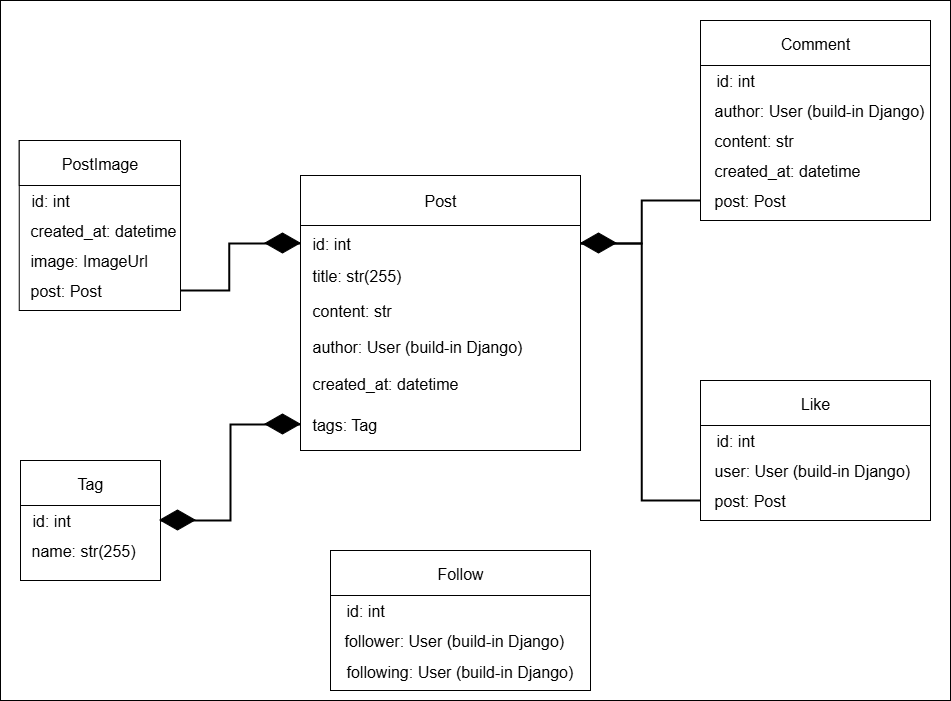

# Social Media API

A RESTful API for a basic social media platform built with Django and Django REST Framework.

## Features

- User registration and authentication (token-based)
- User profile with the ability to follow/unfollow others
- Post creation, listing, and scheduled publishing with Celery
- Commenting and liking functionality
- Tagging system for posts
- Image uploads for posts
- Filtering and searching capabilities
- Well-documented endpoints using drf-spectacular

## Installation

1. Clone the repository:

```bash
git clone https://github.com/your-username/social-media-api.git
cd social-media-api
```

2. Create and activate a virtual environment:

```bash
python -m venv venv
source venv/bin/activate  # On Windows: venv\Scripts\activate
```

3. Install the dependencies:

```bash
pip install -r requirements.txt
```

4. Start Redis and Celery for scheduled posts:

```bash
# Start Redis server (make sure Redis is installed)
docker run -p 6379:6379 redis

# In another terminal, start Celery
celery -A social_media_api worker --loglevel=info --pool=solo
```

5. Apply migrations and run the server:

```bash

python manage.py migrate
python manage.py runserver
```

## API Documentation

Interactive API documentation is available at:

```
http://127.0.0.1:8000/api/schema/swagger-ui/
```

Or Redoc:

```
http://127.0.0.1:8000/api/schema/redoc/
```

## Endpoints Overview

- `POST /api/auth/register/` – Register a new user
- `POST /api/auth/login/` – Login and get token
- `GET /api/social-media/users/` – List/search users
- `POST /api/social-media/posts/` – Create a new post
- `GET /api/social-media/posts/` – List posts (filtering supported)
- `POST /api/social-media/posts/{id}/comment/` – Comment on a post
- `POST /api/social-media/posts/{id}/like/` – Like a post
- `POST /api/social-media/posts/{id}/unlike/` – Unlike a post
- `POST /api/social-media/posts/schedule/` – Schedule a post creation
- `DELETE /api/social-media/comments/{id}/` – Delete a comment
- `POST /api/social-media/post-images/` – Upload an image for a post

## Filtering and Search for Post

- `?title=...`
- `?content=...`
- `?author=...`
- `?created_after=YYYY-MM-DDTHH:MM`
- `?created_before=YYYY-MM-DDTHH:MM`
- `?tags=tag1,tag2`
- `?follower=true|false`
- `?following=true|false`

## Database Schema

You can insert your database model diagram here:



## Created by

ChatGPT and Oleksandr Kukliuk(kluzodota@gmail.com)